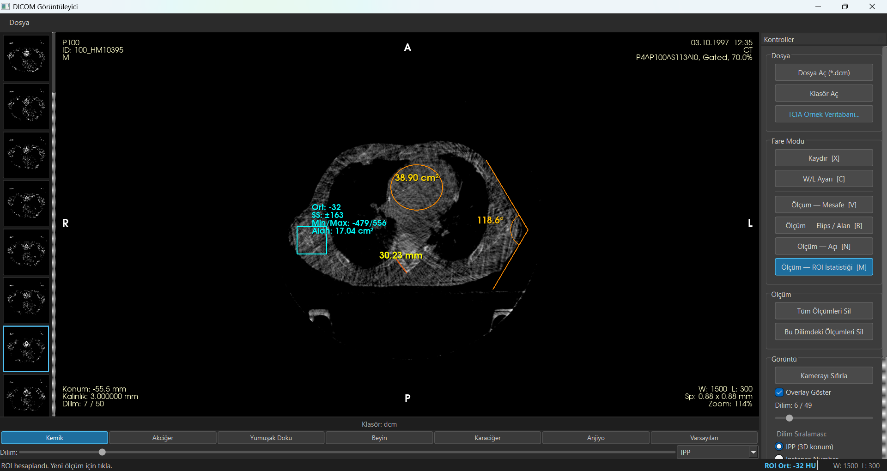
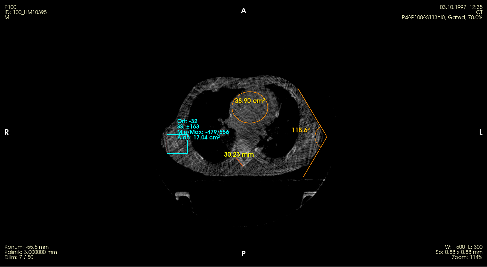
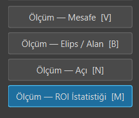
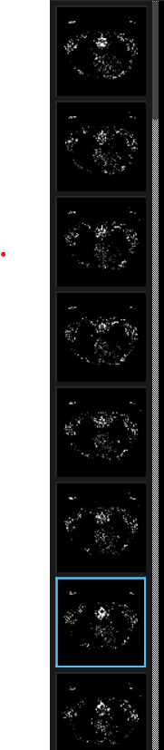
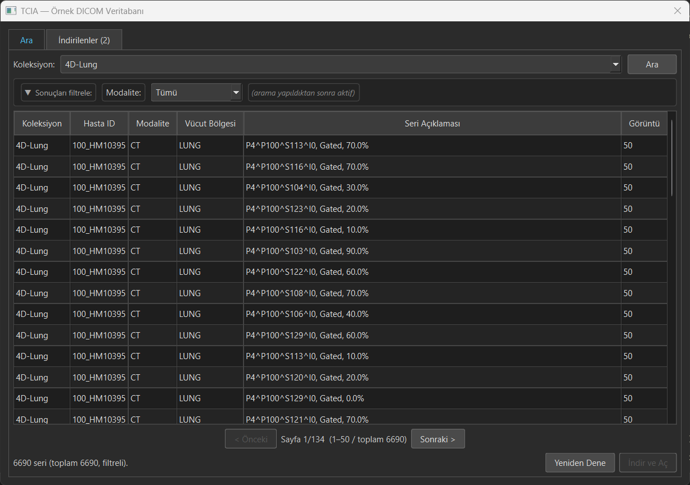

# DICOM Viewer

C++17 / Qt 6.8.3 / VTK 9.3 / GDCM 3.0 ile geliştirilmiş masaüstü DICOM görüntü görüntüleyici.

---

## Özellikler

### HU Dönüşümü & W/L Presetleri

DICOM tag'larından `RescaleSlope` / `RescaleIntercept` okunarak raw piksel değerleri Hounsfield Unit'e çevrilir. Sağ panel ve alt çubukta 7 hazır preset mevcuttur; aktif preset her iki yerde de vurgulanır.

| Preset | WW | WC |
|---|---|---|
| Kemik | 1500 | 300 |
| Akciğer | 1500 | −600 |
| Yumuşak Doku | 400 | 40 |
| Beyin | 80 | 40 |
| Karaciğer | 150 | 60 |
| Anjiyo | 600 | 300 |
| Varsayılan | — | auto |

### 4 Köşe DICOM Overlay

VTK renderer üzerinde dört köşeye `vtkTextActor` ile hasta, çalışma, dilim ve teknik bilgi gösterilir. Sağ paneldeki **Overlay Göster** checkbox'ı ile kapatılabilir.

- **Sol üst:** Hasta adı, ID, doğum tarihi, cinsiyet
- **Sağ üst:** Kurum, inceleme tarihi/saati, modalite, seri açıklaması
- **Sol alt:** Dilim konumu (mm), kalınlık, dilim no
- **Sağ alt:** W/L, piksel aralığı, zoom

### Cursor Altı HU Değeri

Mouse görüntü üzerinde hareket ederken anlık piksel/HU değeri ve koordinatlar status bar'da güncellenir.

### Yönelim İşaretleri

`Image Orientation Patient` (IOP) tag'ından hesaplanan anatomik yön harfleri (R/L/A/P/H/F) görüntünün dört kenarında gösterilir.

### Ölçüm Araçları

| Araç | Kullanım | Çıktı |
|---|---|---|
| Mesafe | 2 tık | mm |
| Elips / Alan | 2 tık (merkez + kenar) | cm² |
| Açı | 3 tık | derece (°) |
| ROI İstatistiği | 2 tık (dikdörtgen) | Ort / SS / Min / Max / Alan |

Tüm ölçümler dilim bazlı; dilim değişince gizlenir, geri dönünce görünür. **Ctrl+Z / Ctrl+Y** ile geri/ileri al, **ESC** ile devam eden çizimi iptal et.

### Thumbnail Şeridi

Görüntünün solunda dikey kaydırmalı thumbnail şeridi bulunur. Aktif dilim mavi kenarlıkla vurgulanır; thumbnail'a tıklayarak dilime atlanır. Arka planda aşamalı yükleme ile performans korunur.

### TCIA Entegrasyonu

**The Cancer Imaging Archive (TCIA)** açık veri tabanına yerleşik tarayıcı üzerinden erişilebilir. Koleksiyon, hasta ve seri seçimi yapılarak DICOM serisi doğrudan indirilebilir ve görüntülenebilir.

### Dilim Sıralama

Klasör yüklendiğinde dilimler üç seçenekle sıralanabilir: **IPP** (3D konum, varsayılan), **Instance Number**, **Dosya adı**.

---

## Klavye Kısayolları

| Tuş | Eylem |
|---|---|
| `X` | Kaydır modu |
| `C` | W/L Ayarı modu |
| `V` | Ölçüm — Mesafe |
| `B` | Ölçüm — Elips |
| `N` | Ölçüm — Açı |
| `M` | Ölçüm — ROI |
| `W` | Sonraki dilim |
| `S` | Önceki dilim |
| `ESC` | Devam eden çizimi iptal et |
| `Ctrl+Z` | Ölçümü geri al |
| `Ctrl+Y` | Ölçümü ileri al |
| `Ctrl+A` | Klasör aç |
| `Ctrl+D` | Dosya aç |
| `Ctrl+T` | TCIA Tarayıcı |

---

## Standartlar & Kapsam

Bu proje geliştirilirken **DICOM Grayscale Standard Display Function (GSDF)** ve FDA'in tıbbi görüntü yazılımlarına yönelik rehber dokümanları incelendi; HU dönüşümü, W/L presetleri ve overlay bilgisi bu standartlardan türetildi. Ancak kısa geliştirme sürecinde tüm klinik gereksinimleri karşılamak mümkün olmadı.

Kapsam dışı bırakılan başlıca özellik: **MPR (Multi-Planar Reconstruction)** — Axial/Coronal/Sagittal 2×2 layout ve crosshair senkronizasyonu gerektiren bu özellik mimari karmaşıklığı nedeniyle eklenmedi.

